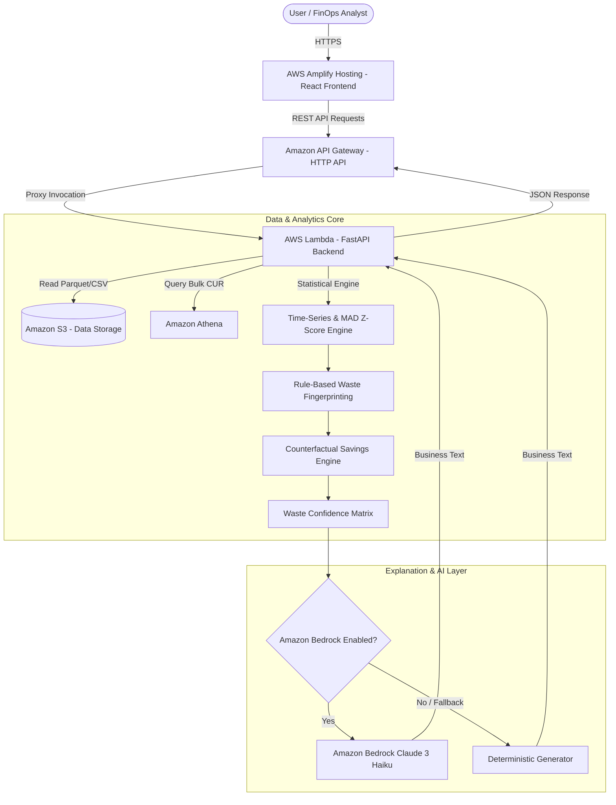

# CostGuard-X System Architecture & Infrastructure Blueprint

## 1. System Overview

CostGuard-X is an industry-oriented Cloud Cost Waste Intelligence web application that analyzes AWS cost and resource utilization data to pinpoint avoidable cloud spend.

The platform is designed around **four primary pillars**:
1. **Data Science Core**: Classical time-series statistics, robust median absolute deviation (MAD Z-Score), rolling averages, and threshold detection. **No machine learning models are used.**
2. **Cloud FinOps Domain**: Resource cost attribution, waste fingerprinting (Idle, Over-provisioned, Non-prod waste, Storage growth), counterfactual scenario modeling, and 0-100 waste confidence scoring.
3. **Generative AI Explanation Layer**: Amazon Bedrock integration converting pre-calculated analytical JSON payloads into simple business explanations, with deterministic template fallbacks.
4. **Serverless AWS Deployment Architecture**: Designed for **zero out-of-pocket cost** using AWS S3, AWS Lambda, Amazon API Gateway, AWS Amplify Hosting, and Amazon Athena.

---

## 2. Serverless AWS Architecture Flow

---

## 3. Zero Out-of-Pocket Cost Strategy

CostGuard-X avoids always-on, high-cost AWS infrastructure:
- **Avoided Infrastructure**: NO always-on EC2 instances, RDS databases, Redshift clusters, EKS clusters, NAT Gateways, or SageMaker endpoints.
- **Utilized Services**:
  - **Amazon S3**: Free tier allowance up to 5 GB storage.
  - **AWS Lambda**: Free tier allowance includes 1 million requests/month and 3.2 million seconds of compute time.
  - **Amazon API Gateway**: Free tier includes 1 million HTTP API calls/month.
  - **AWS Amplify Hosting**: Free tier includes 1,000 build minutes/month and 5 GB served.
  - **Amazon Bedrock**: Pay-per-token API invocation, called strictly on demand for structured explanations.

> **Disclaimer**: CostGuard-X is designed for zero out-of-pocket deployment within applicable AWS Free Tier allowances and available AWS credits using a serverless architecture and controlled usage.
